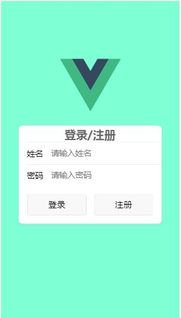
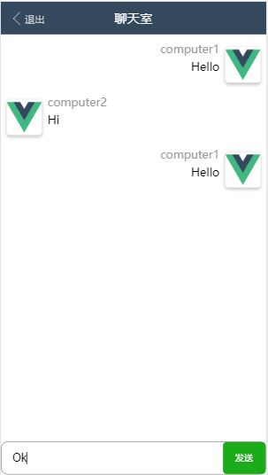

# 项目介绍
WebSocket 是流行的数据交互方式，在学习了 websocket 后，打算使用 vue + websocket + mysql 来完成一个小型的移动端聊天室，简单的实现登录、注册、发送消息等操作。进一步巩固自己对 vue 和 nodeJs 的掌握。

[项目地址](https://github.com/taokexia/simple-vue-chatroom)

项目采用了:
- vux: 移动端UI 框架
- vue-router 路由管理
- socket.io 创建 websocket 服务
- MySQL 用户数据管理
- vue-cli 3.0 创建项目

## 启动项目
启动服务器
```
npm run serve
```
启动客户端
```
npm run dev
```
## 项目截图
登录界面


聊天室


以下是我对项目的总结
# 客户端
## 在 vue-cli 3.0 中引入 vux
vux 官方还不支持直接在 vue-cli 3.0 中引入 vux，需要自己修改配置。

解决方法是在项目目录下创建 `vue.config.js` 文件,添加项目配置:
```js
const vuxLoader = require("vux-loader")
module.exports = {
  configureWebpack: config => {
    vuxLoader.merge(config, {
      plugins: ["vux-ui"]
    });
  }
};
```
之后运行项目，这时可能会遇到 vue-loader 解析文件错误的情况，这时需要安装 14.2.2版本的 vue-loader 才能解决问题：
```js
npm install vue-loader@14.2.2 -D
```
之后重新运行项目

## vue-router 路由传递参数
vue-router 传递参数有两种方法：
1. 使用编程式导航 `router.push`
2. 使用声明式导航 `<router-link>`

### 编程式导航
编程式导航传递的参数可以是字符串、也可以是对象。

字符串是直接使用路由地址以字符串方式进行跳转，简单但不能传递参数。
```js
this.$router.push("/");
```
对象可以用来传递参数。接收 `name`(命名路由)和 `params`(传递参数)。 `name` 是在定义路由时指定 `path` 路径对应的 `name`.
```js
this.$router.push({ name: "index", params: { username: 'xxx' }})
```
在另一个页面接收传递的参数
```js
this.$route.params.username;
```
> 注意: `name` 跟 `params` 配对; `path` 跟 `query` 配对。 使用 `query` 在刷新页面时数据不会丢失。

### 声明式导航
声明式导航传递参数类似。

使用字符串
```js
<router-link to="/">首页</router-link>
```
使用对象
```js
<router-link to="{ name: 'index', params: { username: 'xxx' }}">首页</router-link>
```

# 服务端
## 使用 socket.io
在 `server.js` 中创建 socket,监听客户端的连接，并进行双向通信。
```js
const http = require("http");
const io = require("socket.io");
// 创建 http 服务器
let httpServer = http.createServer();
httpServer.listen(8080);
// 创建 socket
let ws = io.listen(httpServer);
// 服务器监听客户端连接
ws.on("connection", sock => {
  // 处理操作
  // ...
  // 接收客户端发送的消息
  sock.on('xx', () => {});
  // 服务端往客户端发送消息
  sock.emit('xx', data);
}
```
客户端`index.html`中
```html
<!-- 引入客户端脚本 -->
<script src="http://localhost:8080/socket.io/socket.io.js"></script>
<!-- 创建连接 -->
<script>
  const socket = io.connect('ws://localhost:8080/');
  // 客户端往服务器发送消息
  socket.emit('xx', data);
  // 客户端接收服务器消息
  socket.on('xx', () => {});
</script>
```

## MySQL 操作
数据库结构

- `id` 主键、自增
- `username` 用户名
- `password` 密码
- `online` 是否在线,可用于统计在线人数


引入 mysql 模块
```js
const mysql = require("mysql");
// 连接数据库
let db = mysql.createPool({
  host: "localhost",
  user: "test",
  password: "test",
  database: "websocket"
});

// 数据库操作
db.query('数据库操作语句', (err, data) => {
  // 回调函数
  // err 为执行失败的错误信息
  // data 为执行成功的返回数据
})
```